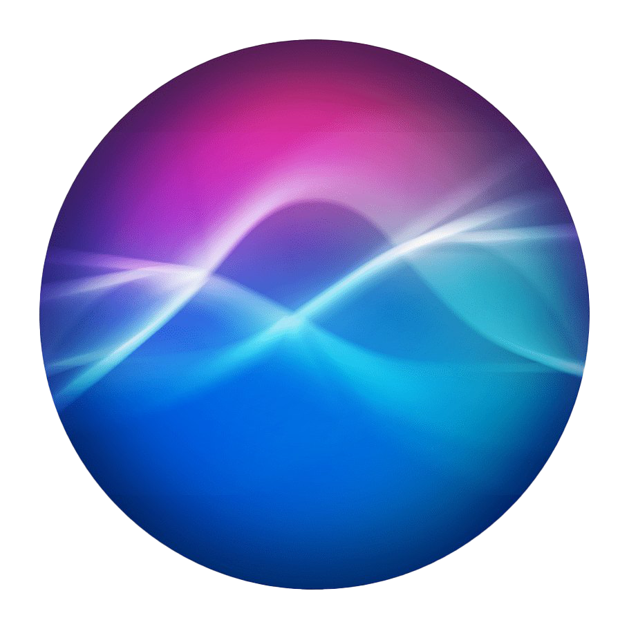
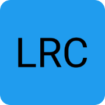
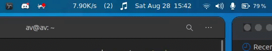

## Hello there! I'm Aayush. Incoming SDE @Publicis Sapient , Prev Research Intern @Samsung R&D. It's nice to see you here.

  
  

  

     &nbsp; 
  

Here I share my builds and try to contribute to the community as much as I can 🤓.
 
You can check my projects below, surely they can be of some use to you and also do suggest changes if you have somethings in your mind.
 
I code for solving real-world problems, social causes, SaaS. I really like listening to people and hearing them out, helping them with my knowledge and experience and also teach them.

Quick pointers: 
 - 🔭 I can come to use in python,cpp related fields(Software development, web development,Android Development(JAVA), ML/AI/DL/DS, competitive programming, databases too).
 - 🌱 I’m currently learning advanced algorithms🎛️.
 - 👯 I’m looking to contribute to open source projects.
 - 💬 You are welcome to have a friendly chat with me, I'm a good listener 😉.
 - 📫 How to reach me? Follow along
    - 🎮discord : AV#5775
    - 🐦twitter : [AayushBVyas](https://twitter.com/AayushBVyas)
    - 📧Email : [aayushbrajeshvyas@gmail.com](aayushbrajeshvyas@gmail.com)
